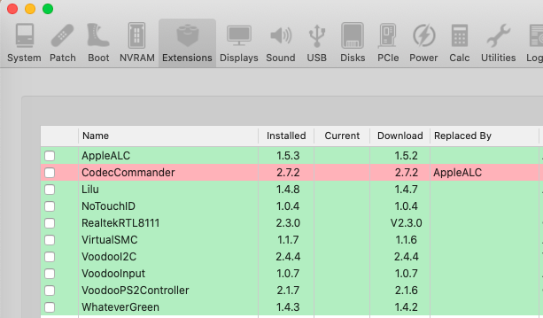

# Acer-Aspire-E5-574G

EFI for with OpenCore bootloader 0.7.3

 
### Computer Spec:

| Component        | Brank                              |
| ---------------- | ---------------------------------- |
| CPU              | Intel® i7 6500U (SKL)              |
| iGPU             | Intel® HD Graphics 520             |
| dGPU             | Nvidia 920m (disabled on macOs)    |
| Display          | 1920x1080                          |
| Audio            | Realtek ALC255                     |
| Ram              | 16 Gb ddr3 1600 Mhz                |
| SSD              | Kingstone A400 128gb               |
| SmBios           | MacbookPro 13,3                    |
| BootLoader       | OpenCore                           |

### PCI List

## Peripherals

## Kext

## USB Map

## TouchPad

This series of laptops uses 2 types of variations on the trackpad. It could be equipped with ELAN trackpad "TPDE" or Synapsy trackpad "TPD1" 

## Video HDMI

### What works and What doesn't or WIP:

- [x] Intel UHD 520 iGPU eDP Output (with Backlight)
- [x] ALC255 Internal Speakers
- [x] All USB Ports
- [x] SpeedStep / Sleep / Wake
- [x] I2C Touchpad with gesture
- [x] Brightness Key
- [x] Realtek RTL8111 LAN
- [x] ACPI Battery
- [x] NVRAM
- [x] Windows boot from OpenCore
- [x] Wifi + Bluetooth
- [ ] Fingerprint (unsupported)
- [ ] Nvidia 920m (unsupported)

### Special Config:

- Usb port mapping performed

### SSDT Info

- Insert Device Apple , Fix Dualboot 

See [ioreg](https://github.com/Baio1977/Acer-Aspire-E5-574G/blob/master/Acer%20Aspire%20574G.ioreg) for more clarification

## Credits

- [Apple](https://apple.com) for macOS;
- [Acidanthera](https://github.com/acidanthera) for OpenCore and all the lovely hackintosh work.
- [Aplelife.ru](https://applelife.ru/threads/dampy-originalnyx-makov.2943712) For ioreg and ACPI of original mac.
- [Dortania](https://github.com/dortania)
- [mald0n](https://github.com/MaLd0n)
- [rehabman](https://github.com/RehabMan)
- [daliansky](https://github.com/daliansky)
- [Hackintoshlifeit](https://github.com/Hackintoshlifeit)

# If you need help please contact us on [Telegram](https://t.me/HackintoshLife_it) or [Web](https://www.hackintoshlife.it/)
